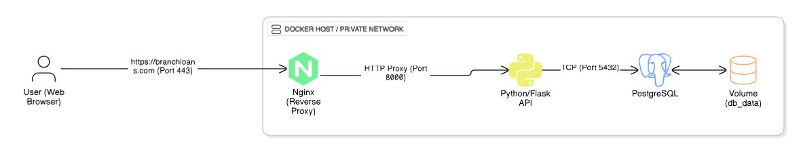
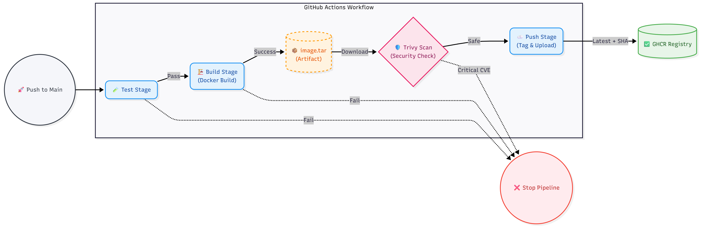

# Flask Microloans API

A production-ready REST API for microloans, fully containerized with Docker. It features a complete DevOps workflow including Nginx SSL termination, multi-environment orchestration (Dev/Stage/Prod), and automated CI/CD with security scanning.

## 🏗 Architecture

The system uses a reverse-proxy architecture to handle SSL termination and route traffic securely to the application layer.

 


**Flow Explanation:**
1. **Client** sends HTTPS request to `https://branchloans.com`
2. **Nginx** terminates SSL, validates certificate, forwards to Flask API
3. **Flask API** validates request using Pydantic schemas
4. **SQLAlchemy ORM** translates Python objects to SQL queries
5. **PostgreSQL** executes queries and returns data
6. **Response** flows back through the same chain

---

### Project Structure

```
microloans-api/
├── 📁 app/                      # Core application code
│   ├── __init__.py              # Flask app factory
│   ├── config.py                # Environment-based configuration
│   ├── db.py                    # Database session management
│   ├── logging.py               # Structured logging setup
│   ├── models.py                # SQLAlchemy models (Loan table)
│   ├── schemas.py               # Pydantic validation schemas
│   └── routes/                  # API endpoint handlers
│       ├── health.py            # Health check endpoint
│       ├── loans.py             # CRUD operations for loans
│       └── stats.py             # Aggregation & analytics
│
├── 📁 alembic/                  # Database migration tool
│   ├── versions/                # Migration scripts (auto-generated)
│   ├── env.py                   # Alembic environment config
│   └── alembic.ini              # Alembic settings
│
├── 📁 scripts/                  # Automation & setup scripts
│   ├── entrypoint.sh            # Container startup script (migrations + seed)
│   ├── generate-cert.sh         # SSL certificate generator
│   └── seed.py                  # Dummy data seeder (idempotent)
│
├── 📁 nginx/                    # Reverse proxy configuration
│   └── nginx.conf               # SSL termination, proxy rules
│
├── 📁 .github/workflows/        # CI/CD automation
│   └── ci-cd.yml               
│
├── 📁 certs/                    # SSL certificates (gitignored)
│   ├── branchloans.com.crt      # Self-signed certificate
│   └── branchloans.com.key      # Private key
│
├── 📁 assets/                   # Documentation images
│   ├── architecture.png         # System architecture diagram
│   └── cicd.png                 # CI/CD pipeline diagram
│
├── 📄 docker-compose.yml        # Multi-environment orchestration
├── 📄 Dockerfile                # Python app container definition
├── 📄 wsgi.py                   # Gunicorn entry point
├── 📄 requirements.txt          # Python dependencies
├── 📄 .env.{dev,stage,prod}.example  # Environment templates
└── 📄 README.md                 # This file
```

## 🛠 Tech Stack

* **Language:** Python 3.11
* **Frameworks:** Flask, SQLAlchemy (ORM), Pydantic (Validation), Alembic (Migrations)
* **Database:** PostgreSQL 16
* **Infrastructure:** Docker, Docker Compose
* **Routing:** Nginx (Reverse Proxy & SSL Termination)
* **DevOps:** GitHub Actions (CI/CD), GitHub Container Registry (GHCR)
* **Security:** Trivy (Container Vulnerability Scanning)

## 📡 Local Setup Guide

### 1. Prerequisites
- Docker Desktop installed and running.
- Git Bash (Windows) or Terminal (Mac/Linux).
- OpenSSL (usually pre-installed).

---

### 2. Clone The Repository
Run the following:

```bash
git clone <your-repo-url>
cd microloans-api
```

---

### 3. Generate SSL Certificate
Run the following:

```bash
./scripts/generate-cert.sh
```

This will generate a self-signed SSL certificate for `branchloans.com` and saved as `certs/branchloans.com.crt` and `certs/branchloans.com.key`.

---

### 4. DNS Configuration (Hosts File)
Map `branchloans.com` to localhost.

**Windows:**
Edit `C:\Windows\System32\drivers\etc\hosts`
Add: `127.0.0.1 branchloans.com`

**Mac/Linux:**
Run: `sudo nano /etc/hosts`
Add: `127.0.0.1 branchloans.com`

---

### 5. Environment Configuration

We use a **single `docker-compose.yml`** file that behaves differently based on the environment file provided.

#### **Step 1: Create Environment Files**

Copy the example files to create your environment configurations:

```bash
cp .env.dev.example .env.dev
cp .env.stage.example .env.stage
cp .env.prod.example .env.prod
```

#### **Step 2: Environment Variables**

Each environment file contains the following variables:

**Environment:**
- **`FLASK_ENV`** - Specifies the environment (`development`, `staging`, or `production`)
- **`LOG_LEVEL`** - Logging level (`DEBUG`, `INFO`, `WARNING`, `ERROR`)

**Database Configuration:**
- **`POSTGRES_USER`** - PostgreSQL username
- **`POSTGRES_PASSWORD`** - PostgreSQL password
- **`POSTGRES_DB`** - Database name
- **`DB_MEMORY_LIMIT`** - Memory limit for database container (e.g., `256m`)
- **`DB_CPU_LIMIT`** - CPU limit for database container (e.g., `1.0`)
- **`DB_POOL_SIZE`** - Database connection pool size
- **`DB_PORT`** - Port on which PostgreSQL listens
- **`DB_VOLUME`** - Volume mount for database persistence (`none` for dev, path for prod)

**API Configuration:**
- **`API_WORKERS`** - Number of Gunicorn workers
- **`API_RELOAD`** - Auto-reload flag (`--reload` for dev, empty for prod)
- **`API_LOG_LEVEL`** - API logging level (`debug`, `info`, `warning`, `error`)
- **`CODE_MOUNT`** - Code volume mount (`.:/app` for dev hot-reload, `none` for prod)
- **`API_PORT`** - Port on which the API server listens

**Configuration Differences:**

Here is a breakdown of how the application behavior changes across environments:

| Variable            | Development      | Staging          | Production       | Purpose |
|---------------------|------------------|------------------|------------------|---------|
| **`FLASK_ENV`**     | `development`    | `staging`        | `production`     | Sets Flask runtime mode |
| **`LOG_LEVEL`**     | `DEBUG`          | `INFO`           | `WARNING`        | Controls verbosity of logs |
| **`API_PORT`**      | `8001`           | `8000`           | `8002`           | Avoids port conflicts when running multiple envs |
| **`API_WORKERS`**   | `2`              | `4`              | `8`              | Scales worker processes based on load |
| **`API_RELOAD`**    | `--reload`       | _(empty)_        | _(empty)_        | Dev needs instant feedback, Prod needs stability |
| **`API_LOG_LEVEL`** | `debug`          | `info`           | `warning`        | API-specific logging verbosity |
| **`CODE_MOUNT`**    | `.:/app`         | _(empty)_        | _(empty)_        | Dev mounts local code for hot-reload, Prod uses built image |
| **`DB_PORT`**       | `5433`           | `5432`           | `5434`           | Separate database ports per environment |
| **`DB_MEMORY_LIMIT`** | `256m`         | `512m`           | `1g`             | Simulates real resource constraints |
| **`DB_CPU_LIMIT`**  | `1.0`            | `2.0`            | `4.0`            | CPU allocation scales with environment |
| **`DB_POOL_SIZE`**  | `5`              | `10`             | `20`             | Connection pool size increases with load |
| **`DB_VOLUME`**     | `db_data_dev`    | `db_data_stage`  | `db_data_prod`   | Keeps data separate and persistent per environment |

---

## 6. Running the Application

Once your SSL certificates are generated and environment files are created, you can launch the application in any environment using Docker Compose.

### **Development Environment**

Run the application with hot-reload enabled for local development:

```bash
docker compose --env-file .env.dev up --build
```

**What happens:**
- API runs on port `8001` with auto-reload enabled
- Code changes are instantly reflected (no rebuild needed)
- Database runs on port `5433` with minimal resources
- Verbose debug logging for troubleshooting

**Access the application:**
- API: `https://branchloans.com`
- Health check: `https://branchloans.com/health`

---

### **Staging Environment**

Run the application in staging mode to test production-like behavior:

```bash
docker compose --env-file .env.stage up --build
```

**What happens:**
- API runs on port `8000` without auto-reload
- Uses built Docker image (not mounted code)
- Database runs on port `5432` with moderate resources
- Info-level logging

**Access the application:**
- API: `https://branchloans.com`
- Health check: `https://branchloans.com/health`

---

### **Production Environment**

Run the application in production mode with optimized settings:

```bash
docker compose --env-file .env.prod up --build
```

**What happens:**
- API runs on port `8002` with maximum workers
- Uses production-optimized Docker image
- Database runs on port `5434` with full resources
- Warning-level logging only

**Access the application:**
- API: `https://branchloans.com`
- Health check: `https://branchloans.com/health`

---

### **Important Notes**

> [NOTE]
> **No manual migrations needed!** The `scripts/entrypoint.sh` script automatically handles database migrations on startup. It will:
> - Wait for the database to be ready
> - Run Alembic migrations (`alembic upgrade head`)
> - Seed initial data if needed
> - Start the API server

> [TIP]
> To run in detached mode (background), add the `-d` flag:
> ```bash
> docker compose --env-file .env.dev up --build -d
> ```

> [TIP]
> To stop the application:
> ```bash
> docker compose --env-file .env.dev down
> ```

---

**Access the application:**
- API: `https://branchloans.com`
- Health check: `https://branchloans.com/health`

---

### **Staging Environment**

Run the application in staging mode to test production-like behavior:

```bash
docker compose --env-file .env.stage up --build
```

**What happens:**
- API runs on port `8000` without auto-reload
- Uses built Docker image (not mounted code)
- Database runs on port `5432` with moderate resources
- Info-level logging

**Access the application:**
- API: `https://branchloans.com`
- Health check: `https://branchloans.com/health`

---

### **Production Environment**

Run the application in production mode with optimized settings:

```bash
docker compose --env-file .env.prod up --build
```

**What happens:**
- API runs on port `8002` with maximum workers
- Uses production-optimized Docker image
- Database runs on port `5434` with full resources
- Warning-level logging only

**Access the application:**
- API: `https://branchloans.com`
- Health check: `https://branchloans.com/health`

---

### **Important Notes**

> [NOTE]
> **No manual migrations needed!** The `scripts/entrypoint.sh` script automatically handles database migrations on startup. It will:
> - Wait for the database to be ready
> - Run Alembic migrations (`alembic upgrade head`)
> - Seed initial data if needed
> - Start the API server

> [TIP]
> To run in detached mode (background), add the `-d` flag:
> ```bash
> docker compose --env-file .env.dev up --build -d
> ```

> [TIP]
> To stop the application:
> ```bash
> docker compose --env-file .env.dev down
> ```


---


## 📚 API

### Endpoints

#### `GET /health`
Health check endpoint (returns `200 OK` if the database is connected, `503 Service Unavailable` otherwise).

**Response:**
```json
{
  "status": "ok"
}
```

#### `GET /api/loans`
List all loans.

**Response:**
```json
[
  {
    "id": "00000000-0000-0000-0000-000000000001",
    "borrower_id": "usr_kenya_001",
    "amount": 12500.00,
    "currency": "KES",
    "status": "pending",
    "term_months": 6,
    "interest_rate_apr": 28.00,
    "created_at": "2025-01-01T00:00:00Z",
    "updated_at": "2025-01-01T00:00:00Z"
  },
  {
    "id": "00000000-0000-0000-0000-000000000002",
    "borrower_id": "usr_india_002",
    "amount": 50000.00,
    "currency": "INR",
    "status": "approved",
    "term_months": 12,
    "interest_rate_apr": 24.00,
    "created_at": "2025-01-01T00:00:00Z",
    "updated_at": "2025-01-01T00:00:00Z"
  }
]
```

#### `GET /api/loans/:id`
Get specific loan by ID.

**Example:** `GET /api/loans/00000000-0000-0000-0000-000000000001`

**Response:**
```json
{
  "id": "00000000-0000-0000-0000-000000000001",
  "borrower_id": "usr_kenya_001",
  "amount": 12500.00,
  "currency": "KES",
  "status": "pending",
  "term_months": 6,
  "interest_rate_apr": 28.00,
  "created_at": "2025-01-01T00:00:00Z",
  "updated_at": "2025-01-01T00:00:00Z"
}
```

#### `POST /api/loans`
Create new loan application.

**Request:**
```json
{
  "borrower_id": "usr_philippines_006",
  "amount": 35000.00,
  "currency": "PHP",
  "term_months": 9,
  "interest_rate_apr": 25.50
}
```

**Validation Rules:**
- `amount`: 0 < amount ≤ 50,000
- `currency`: 3-character code (e.g., INR, KES, NGN, VND, PHP)
- `term_months`: ≥ 1
- `interest_rate_apr`: 0 ≤ rate ≤ 100

```json
{
  "id": "generated-uuid",
  "borrower_id": "usr_philippines_006",
  "amount": 35000.00,
  "currency": "PHP",
  "status": "pending",
  "term_months": 9,
  "interest_rate_apr": 25.50,
  "created_at": "2025-01-01T00:00:00Z",
  "updated_at": "2025-01-01T00:00:00Z"
}
```

#### `GET /api/stats`
Get loan statistics aggregated by status and currency.

**Response:**
```json
{
  "total_loans": 5,
  "total_amount": 123900.00,
  "avg_amount": 24780.00,
  "by_status": {
    "pending": 1,
    "approved": 1,
    "rejected": 1,
    "disbursed": 1,
    "repaid": 1
  },
  "by_currency": {
    "KES": 1,
    "INR": 1,
    "NGN": 1,
    "VND": 1,
    "PHP": 1
  }
}
```

> [NOTE]
> The above stats reflect the seeded data from `scripts/seed.py`. Your actual stats will vary based on the loans in your database.

---

## 🔄 CI/CD Pipeline

The project uses **GitHub Actions** for a secure, automated release pipeline. The workflow is defined in `.github/workflows/ci-cd.yml`.

### **Pipeline Architecture**

We use an **Artifact-Based Workflow** to ensure security. Instead of pushing to the registry and *then* scanning (which risks exposing bad code), we build locally, scan locally, and only push if safe.



### **Pipeline Stages**

#### 🧪 Test Stage

- Spins up a temporary Postgres **Service Container** inside GitHub Actions
- Injects **Secrets** (DB URL, Keys) into the runner's memory
- Runs `pytest`. If tests fail, the pipeline stops immediately

#### 🏗 Build Stage

- Builds the Docker image using `docker buildx`
- **Crucial:** Does not push to the registry yet
- Exports the image as a `.tar` file (Artifact) to be passed to the next job

#### 🛡 Security Scan Stage

- Downloads the `.tar` artifact
- Uses **Trivy** to scan the image filesystem for vulnerabilities (CVEs)
- **Gatekeeper:** If any CRITICAL vulnerability is found, the pipeline fails

#### 🚀 Push Stage

- Only runs on the `main` branch (never on PRs)
- Downloads the verified `.tar` artifact
- Tags the image with the **Git Commit SHA** (for history) and **Latest** (for deployment)
- Pushes to **GitHub Container Registry (GHCR)**

### **Secrets Management**

Sensitive data (API keys, DB passwords) is never committed to code.

- **Storage:** Secrets are stored in GitHub Repository Secrets
- **Runtime:** They are injected as environment variables only during the specific steps that need them
- **Logs:** GitHub automatically masks secrets in logs (displays as `***`)


# 📐 Design Decisions & Trade-offs

This document outlines the architectural choices made during the development of the Microloans API, the reasoning behind them, and the trade-offs considered.

---

## 1. Infrastructure & Orchestration

### Single `docker-compose.yml` for All Environments
Instead of maintaining separate files (`docker-compose.dev.yml`, `prod.yml`), we use a single template file and inject configuration via Environment Variables.
* **Why:** Adheres to the **DRY (Don't Repeat Yourself)** principle. It ensures the structural architecture (network, volumes, dependencies) remains identical across Dev, Stage, and Prod, minimizing "it works on my machine" issues.
* **Trade-off:** The `docker-compose.yml` becomes slightly more complex to read due to the heavy use of `${VARIABLE}` syntax.

### Port Isolation Strategy
We assigned distinct host ports for every environment (Dev: `8001`, Stage: `8000`, Prod: `8002`) and distinct Database ports.
* **Why:** This allows all three environments to run **simultaneously** on the same machine without port collisions. It enables a developer to fix a bug in Dev while the Staging environment is being tested by QA on the same host.
* **Trade-off:** Requires manual port management and strict documentation so developers know which port belongs to which environment.

### Nginx Reverse Proxy
We placed Nginx in front of the Python application container.
* **Why:** Python WSGI servers (Gunicorn) are not designed to face the open internet. Nginx handles SSL termination efficiently, buffers slow clients (Slowloris protection), and serves static assets.
* **Trade-off:** Adds complexity to the local setup (requires generating certificates and mapping the `hosts` file) compared to accessing the Flask app directly.

---

## 2. Configuration Management

### Environment Variable Injection (.env files)
We use specific files (`.env.dev`, `.env.prod`) loaded at runtime.
* **Why:** Adheres to the **12-Factor App** methodology. Config is separated strictly from code.
* **Trade-off:** Developers must manually create these files from `.env.example` templates, which adds a setup step.

### Helper Scripts (`entrypoint.sh`, `generate-cert.sh`)
We automated setup tasks using Bash scripts.
* **Why:** **Developer Experience (DX).** It abstracts away complex commands.
    * `generate-cert.sh`: Prevents users from needing to memorize long OpenSSL commands.
    * `entrypoint.sh`: Ensures migrations and seeding happen automatically on startup, preventing "Table not found" errors.
* **Trade-off:** "Magic" scripts can sometimes hide errors or make it harder for juniors to understand exactly what commands are being run under the hood.

### Strict `.gitignore` and `.dockerignore`
We explicitly ignore all `.env` files, certificates, and virtual environments.
* **Why:** **Security & Performance.**
    * Security: Prevents accidental commit of secrets/keys to GitHub.
    * Performance: `.dockerignore` prevents the `venv` folder and local certificates from bloating the Docker build context.
* **Trade-off:** New team members must strictly follow the `.env.example` guide to get started, as they cannot "clone and run" without configuration.

---

## 3. CI/CD Pipeline Architecture

### Artifact-Based Workflow (Build -> Tar -> Scan -> Push)
Instead of pushing to the registry and then scanning, we build the image locally, save it as a `.tar` artifact, scan that file, and only push if it passes.
* **Why:** **Zero-Trust Security.** This guarantees that no vulnerability ever reaches the registry. It also ensures "Binary Equality"—the exact bits we scanned are the exact bits we push.
* **Trade-off:** The pipeline is slower. Uploading and downloading large `.tar` artifacts between GitHub Actions jobs consumes time and bandwidth compared to a direct push.

---

## 🔮 Future Improvements (With More Time)

If this project were to scale, I would implement the following:

1.  **Secret Management Vault:**
    * Currently, secrets are injected via GitHub Secrets. For a larger team, I would use **AWS Secrets Manager** to rotate keys automatically.
2.  **Kubernetes (K8s):**
    * If traffic increased significantly, I would migrate from Docker Compose to Kubernetes to utilize auto-scaling and zero-downtime deployments (Rolling Updates).

## 🔧 Troubleshooting

<details>
<summary><strong>Click to view Common Fixes</strong></summary>

### 1. "Bind for 0.0.0.0:5432 failed"
* **Cause:** Local Postgres is running.
* **Fix:** Stop the local service (`sudo service postgresql stop` or Task Manager).

### 2. Browser Security Warning
* **Cause:** Self-signed certificates.
* **Fix:** Click "Advanced" -> "Proceed to branchloans.com".

</details>